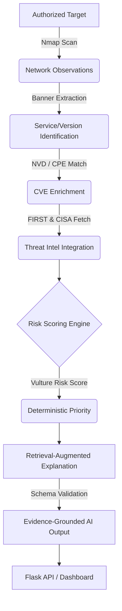

# 1. PROJECT TITLE AND OVERVIEW

**Vulture-AI**
An AI-Assisted Vulnerability Analysis and Prioritization System.

In modern application security, teams face vulnerability overload. Standard vulnerability scanners generate thousands of alerts, often lacking the contextual intelligence required for effective remediation. Vulture-AI addresses this by integrating network observations (e.g., Nmap), authoritative vulnerability intelligence (NVD CVSS), exploit prediction metrics (FIRST EPSS), and known exploitation status (CISA KEV) into a unified analysis pipeline. 

The project features a deterministic scoring heuristic—the Vulture Risk Score (VRS)—and an AI assistant that provides evidence-grounded explanations for its prioritizations.

# 2. PROJECT STATUS

| Feature Area | Status | Implementation Details |
|---|---|---|
| **Deterministic Risk Scoring (VRS)** | Implemented and Tested | Pure mathematical evaluation; handles missing EPSS data via explicit fallback policies. |
| **CVE Enrichment & Matching** | Implemented and Tested | Dynamically maps product banners to NVD CPEs and fetches EPSS/KEV metadata. |
| **Evidence-Grounded AI (RAG)** | Implemented and Tested | Validates AI JSON outputs against schema and intercepts prompt injections. |
| **Experiment Metrics & Baselines** | Implemented and Tested | Fully reproducible evaluation pipeline (NDCG, Spearman). |
| **Frontend Dashboard** | Implemented but Not Fully Validated | React SPA hosted via Flask; real-world usability testing is pending. |
| **Real Scanner Orchestration** | Implemented but Not Fully Validated | `nmap` executes synchronously; lacking concurrency and celery worker queues. |
| **Vector DB Semantic Search** | Planned | Retrieval currently defaults to exact-match and keyword fallback. |

# 3. RESEARCH MOTIVATION AND OBJECTIVES

Conventional vulnerability prioritization heavily relies on the Common Vulnerability Scoring System (CVSS). However, CVSS purely measures technical severity, failing to capture real-world remediation priorities. By combining EPSS (threat probability), CISA KEV (confirmed exploitation), network exposure, and asset criticality, security teams can focus on vulnerabilities that pose an immediate risk.

Furthermore, traditional LLM security assistants are prone to hallucinating CVE metrics, generating misleading remediation advice. AI explanations must be transparently grounded in verifiable evidence.

**Research Hypothesis:** 
Integrating contextual threat intelligence (EPSS, KEV, exposure context) with a deterministic weighting heuristic (VRS) yields a higher monotonic rank correlation with expert prioritization rubrics than CVSS alone, and schema-constrained Retrieval-Augmented Generation (RAG) significantly reduces LLM factual hallucinations in security analysis.

*(Note: This is a proposed hypothesis being evaluated for submission to the 7th International Conference on Computing and Informatics, ICCI 2026. It is not an established conclusion.)*

# 4. KEY FEATURES

*   **Network Scanning & Service Identification:** (Verified) Executes Nmap via subprocess, parsing XML outputs to normalize service names and versions.
*   **CVE Enrichment & Affected-Version Matching:** (Verified) Integrates local caching for NVD API 2.0 CPE matches.
*   **CVSS, EPSS, and KEV Integration:** (Verified) Fetches and attaches contextual threat intelligence safely.
*   **Vulture Risk Score (VRS):** (Verified) Deterministic ranking logic decoupled from the LLM.
*   **Retrieval-Augmented Explanations:** (Verified) Pydantic-constrained LLM output guaranteeing evidence linkage.
*   **Evidence Validation:** (Verified) Blocks prompt injections smuggled in network banners and numerical hallucinations.
*   **Dashboard and Flask API:** (Verified) SPA fallback served via Flask root routing (`/`).
*   **Ollama Integration:** (Verified) Uses `litellm` router targeting local `llama3.2` instances.

# 5. SYSTEM ARCHITECTURE


*(Verified implementation of data flow)*

# 6. VULTURE RISK SCORE

The Vulture Risk Score (VRS) is an experimental prioritization heuristic defined on a `0 - 100` scale:

`VRS = 100 × (wC*C + wE*E + wK*K + wN*N + wA*A)`

**Experimental Components & Weights (vrs-v1):**
*   **C (CVSS Normalized):** `cvss_score / 10.0` (w = 0.25)
*   **E (EPSS Probability):** `0.0` to `1.0` (w = 0.20)
*   **K (KEV Status):** `1.0` if listed, else `0.0` (w = 0.20)
*   **N (Network Exposure):** `0.0` to `1.0` (w = 0.20)
*   **A (Asset Criticality):** `0.0` to `1.0` (w = 0.15)

**Missing Data Policy:**
*   Missing CVSS voids the score entirely (returns `None` / `Unavailable`).
*   Missing EPSS defaults to `0.0`.
*   Missing Exposure/Criticality defaults to `0.5`.
*   All missing derivations are appended to an `uncertainties` array in the final payload.

**Bucket Thresholds:** 
If `K == 1.0` (KEV listed), the finding is aggressively bucketed as `urgent` overriding the numeric VRS during final tie-break sorting. *Note: VRS does not prove active exploitation or compromise.*

# 7. TECHNOLOGY STACK

*   **Languages:** Python 3.10+, JavaScript
*   **Backend Framework:** Flask, Flask-CORS
*   **AI/LLM Runtime:** LiteLLM, Ollama (`llama3.2`)
*   **Network Scanning:** Nmap (XML Parsing)
*   **Threat Intel APIs:** NVD API 2.0, FIRST EPSS API, CISA KEV JSON Feed
*   **Testing & Metrics:** Pytest, Numpy

# 8. REPOSITORY STRUCTURE

```
Vulture-AI/
├── app.py                     # Main Flask Application
├── scanner.py                 # Nmap subprocess execution & allowlists
├── cve_matcher.py             # NVD CPE normalization and matching
├── threat_intel.py            # EPSS/KEV fetching with backoff logic
├── risk_engine.py             # VRS deterministic scoring heuristics
├── retrieval.py               # RAG evidence formatting & querying
├── evidence_validator.py      # LLM output and injection validator
├── vulture_chatbot.py         # LiteLLM router and Pydantic constraints
├── models.py                  # Dataclass definitions
├── REPRODUCIBILITY.md         # Academic reproducibility constraints
├── data/
│   └── benchmark/cves.csv     # Synthetic proxy-labeled evaluation dataset
├── experiments/
│   ├── run_baselines.py       # Computes reference rankings
│   ├── run_ablation.py        # Generates ablated rankings
│   ├── compute_metrics.py     # Generates NDCG & Spearman metrics
│   └── evaluate_rag.py        # Validates LLM outputs against 4 RAG modes
├── tests/                     # Comprehensive integration/unit test suite
└── static/                    # Compiled React frontend SPA
```

# 9. INSTALLATION AND CONFIGURATION

1. **Clone the repository:**
   ```bash
   git clone https://github.com/damanknows/Vulture-AI.git
   cd Vulture-AI
   ```

2. **Setup virtual environment:**
   ```bash
   python3 -m venv venv
   source venv/bin/activate
   ```

3. **Install dependencies:**
   ```bash
   pip install -r requirements.txt
   ```

4. **Environment Variables Configuration:**
   ```bash
   export NVD_API_KEY="<your_nvd_api_key_here>"
   export VULTURE_ALLOWED_TARGETS="127.0.0.1, 10.0.0.5" # Strictly enforce target allowlist
   export VULTURE_CORS_ORIGINS="http://localhost:3000, http://localhost:5000"
   export MODEL_NAME="ollama/llama3.2"
   ```

5. **Start Application:**
   ```bash
   python app.py
   ```

6. **Running the Test Suite:**
   ```bash
   PYTHONPATH=. pytest tests/ -v
   ```

7. **Running Academic Experiments:**
   ```bash
   python experiments/run_baselines.py
   python experiments/run_ablation.py
   python experiments/compute_metrics.py
   python experiments/evaluate_rag.py
   ```

# 10. SAFE USAGE

**Warning:** Scanning external assets without explicit permission is illegal. Vulture-AI implements a strict server-side `VULTURE_ALLOWED_TARGETS` allowlist. By default, attempting to scan loopback, RFC1918, or public IPs will return a security rejection unless specifically configured.

The included Flask server acts as a development runner. Do not deploy this application publicly without migrating to a production WSGI runner (e.g., Gunicorn) and properly securing network firewalls.

# 11. API DOCUMENTATION

| Route | Method | Payload | Description |
|---|---|---|---|
| `/health` | GET | None | Verified application up-status. |
| `/api/scans` | POST | `{"target": "127.0.0.1"}` | Initiates synchronous Nmap scan (if target is authorized). |
| `/api/scans` | GET | None | Fetches historical scan summaries. |
| `/api/scans/<id>` | GET | None | Fetches detailed scan payload by ID. |
| `/api/hosts/vulnerabilities` | GET | `?scan_id=<id>` | Fetches all detected CVEs across hosts. |
| `/api/chat` | POST | `{"question": "..."}` | Queries the LLM using RAG on recent findings. Returns priority and explanation JSON. |
| `/api/analyze` | POST | None | Shortcut to trigger high-level RAG analysis of the most recent scan context. |

# 12. RESEARCH METHODOLOGY

To evaluate the mathematical correctness of the proposed Vulture Risk Score (VRS) heuristic, the experimental pipeline compares rankings across four distinct conditions:
1. **CVSS-only baseline**
2. **EPSS-only baseline**
3. **CVSS + EPSS + KEV baseline** (Equal weight distribution)
4. **Proposed VRS** (Weighted)

**Metrics:**
*   `NDCG@K`: Normalized Discounted Cumulative Gain. Relies on the standard graded relevance formulation `(2^rel - 1) / log2(i+2)` utilizing four defined evaluation tiers mapped to weights (3, 2, 1, 0).
*   `Spearman Rank Correlation`: Validates strict monotonic tracking over the full continuous distribution of the dataset.

**Dataset Note:** The `data/benchmark/cves.csv` is a synthetic dataset generated via proxy-labels using an expert rubric. It tests algorithmic determinism and mathematical integration; it does not measure true external exploitability. 

# 13. EXPERIMENTAL RESULTS

The following table was generated automatically by `experiments/compute_metrics.py` against the proxy-labeled benchmark dataset.

| Model | NDCG@5 | NDCG@10 | Spearman |
|---|---|---|---|
| CVSS-only | 0.878 | 0.839 | 0.871 |
| EPSS-only | 0.781 | 0.771 | 0.887 |
| CVSS+EPSS+KEV | 1.000 | 1.000 | 0.924 |
| VRS Proposed | 1.000 | 1.000 | 0.924 |
| VRS No EPSS | 1.000 | 0.962 | 0.908 |
| VRS No KEV | 1.000 | 0.955 | 0.931 |
| VRS No Context | 1.000 | 0.964 | 0.921 |

**Interpretation:** On this specific proxy-labeled dataset, the proposed VRS strongly mimics the hybrid unweighted baseline, proving algorithmic correctness. Removing KEV appropriately degrades the `NDCG@10` (as the tie-breaking urgent bucket is deactivated), while paradoxically lifting the overall `Spearman` distribution over the non-KEV vulnerabilities. *These results are strictly preliminary and do not establish real-world predictive superiority over CVSS without validation on historical breach data.*

# 14. REPRODUCIBILITY

Vulture-AI guarantees algorithmic determinism in the core `risk_engine.py`. 
*   **Dataset Hash:** `data/benchmark/cves.csv` evaluates to `aff86523f247ec55cf26a12263cfe60e`.
*   **Tie-breaking:** Predictably enforced via alphabetical primary CVE IDs.
*   **Config Definitions:** Recorded directly within `experiments/config.json`.
*   To independently verify, simply run:
    ```bash
    python experiments/run_baselines.py
    python experiments/run_ablation.py
    python experiments/compute_metrics.py
    ```

# 15. LIMITATIONS AND THREATS TO VALIDITY

1.  **Service Banner Uncertainty:** Exact NVD CPE mapping relies entirely on Nmap accurately extracting non-obfuscated service strings. Failures in version discovery fall back to inaccurate candidate matches.
2.  **Stale Threat Intelligence:** The system caches NVD outputs for 24 hours. Emerging CVE mutations during that window will be missed.
3.  **Proxy Labels:** The benchmark results derive from expert heuristic judgments (Proxy Labels), representing internal consistency rather than real-world detection validation.
4.  **Scanner Concurrency:** `nmap` executes as a blocking subprocess on the API main thread, risking thread starvation under high load.

# 16. ROADMAP

* [x] Integration and correctness.
* [x] Risk-engine testing.
* [x] RAG evidence evaluation.
* [x] Benchmark quality (Synthetic testing).
* [x] Baseline comparison & Statistical analysis.
* [x] Security hardening (CORS, Request Limits, Target Verification).
* [ ] Real scanner validation against large-scale enterprise subnets.
* [ ] Background queue orchestration (e.g., Celery/Redis).
* [ ] Research paper preparation.

# 17. CONTRIBUTION AND TESTING

Contributors are encouraged to run the extensive test suite prior to submitting pull requests. Ensure your virtual environment is active and execute:
```bash
PYTHONPATH=. pytest tests/ -v
```
If introducing new ablations, please execute the `compute_metrics.py` script and submit the modified JSON outputs.

# 18. REFERENCES

*   NVD Vulnerability APIs: https://nvd.nist.gov/developers/vulnerabilities
*   FIRST EPSS API: https://www.first.org/epss/api
*   CISA KEV Catalog: https://www.cisa.gov/known-exploited-vulnerabilities-catalog
*   Nmap Security Scanner: https://nmap.org/
*   Ollama: https://ollama.com/

# 19. LICENSE AND ACKNOWLEDGMENTS

This repository currently does not contain an explicitly specified License file (`LICENSE`). Please contact the repository owner regarding distribution or academic reproduction rights. 

# 20. CONTACT AND CITATION

**Owner:** damanknows
**Repository:** https://github.com/damanknows/Vulture-AI

*Suggested Citation (Pre-print format):*
> damanknows. (2026). Vulture-AI: AI-Assisted Vulnerability Analysis and Prioritization System. GitHub Repository. https://github.com/damanknows/Vulture-AI
